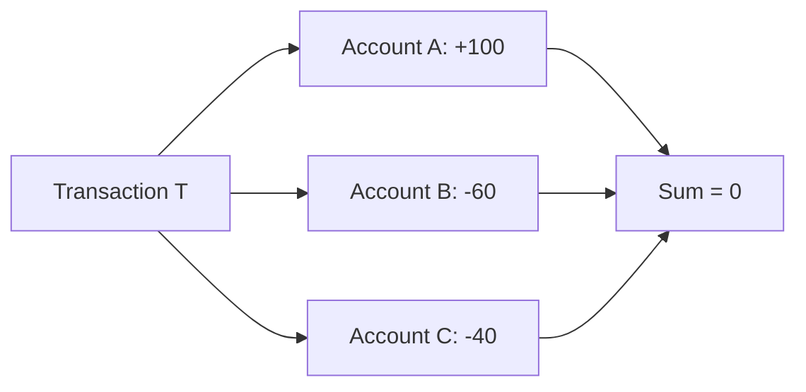

# Accounting Model

## Modelo matemático

Sea una transacción comprometida `T` con entradas `e1..en`, todas en una misma comunidad y unidad:

```text
n >= 2
sum(amount(ei)) = 0
balance(account, t) = sum(committed entries for account up to t)
```

Importes usan precisión decimal declarada por la unidad; nunca coma flotante binaria. La serialización canónica debe fijar representación, escala permitida y reglas de redondeo. No se permite redondear cada lado de forma que rompa el cero.

Core v0.1 freezes amounts as signed base-10 integer strings in minor units and Unit scale `0..18`. Exact integer arithmetic applies before zero-sum validation; floats, exponents, leading zeros, plus sign and negative zero are invalid.



## Creación de crédito

Antes: `A=0, B=0`. A presta un servicio a B por 20: `A=+20, B=-20`. El sistema no transfirió una moneda existente: registró simultáneamente un activo comunitario y crédito utilizado. Si B sirve después a C por 10: `B=-10, C=-10`; B no necesita volver a comerciar con A.

## Operaciones multipartes

El núcleo admite `n` entradas para reparto de valor, costes compartidos o settlement. Una transacción multiparte requiere autorización acorde con cada cuenta afectada y no debe utilizar una cuenta artificial para ocultar una suma incorrecta.

## Cuentas especiales

Reservas, seguros, tasas comunitarias o clearing pueden representarse como cuentas explícitas sólo si una regla versionada define control, financiación, uso y auditoría. No crean una excepción a `sum(entries)=0`. Su existencia y si cuentan en el cierre comunitario deben quedar declaradas, evitando el término engañoso “sistema cerrado” cuando hay fronteras/federación.

For Single Community v0.1, `CommunityLossAccount` and `CommunityPenaltyAccount` are governed special accounts and are always included in the closed community/unit balance sum. Write-off, economic penalty and penalty-to-loss offset use ordinary zero-sum transactions. A special account is not a participant and cannot receive a unilateral administrative adjustment.

Their direct-purpose matrix is fixed: CommunityPenaltyAccount only PENALTY/LOSS_OFFSET and CommunityLossAccount only WRITE_OFF/LOSS_OFFSET. Exact full REVERSAL may mechanically reproduce either from its original; it cannot introduce one. PENALTY debits sanctioned and credits penalty; LOSS_OFFSET debits penalty and credits loss. WRITE_OFF v0.1 is full-only and leaves the defaulted account exactly zero.

Their AccountControlPolicy is never silently bypassed. For a permitted governed resolution, a valid GovernedAuthorization may explicitly cover a special account and thereby satisfy authorization for that exact signed transaction only.

## Reversal, correction y dispute settlement

- `reversal`: nueva transacción con entradas opuestas, referencia inequívoca a la original y autorización/política válida.
- `correction`: una o más transacciones nuevas que dejan la posición correcta; nunca reescribe la original.
- `dispute settlement`: resultado humano/gubernativo que puede producir una transacción de ajuste. La evidencia del caso y el asiento son conceptos distintos.

Una reversión total sólo puede aplicarse una vez por importe neto; reversiones parciales deben declarar cuánto queda reversible para impedir sobre-reversión.

Core v0.1 narrows this further: only one full REVERSAL is valid, it references exactly one non-reversal original and reproduces every entry in original order with the opposite sign. Partial reversal is invalid and partial adjustment uses SETTLEMENT.

## Enforced liability

CreditFloor limits voluntary exposure only. FINAL-finding RESTITUTION/PENALTY may cross it while preserving zero sum. `enforcedLiability=max(0, creditFloor-balance)` is a projection on the same journal/balance, not another ledger. Below floor, voluntary negative capacity is zero; positive/improving entries remain possible.

RESTITUTION accounting is identical on both authorization paths. Voluntary restitution has Account Authorization and no mandate basis; imposed restitution has GovernanceAuthorization plus exactly matched FINAL_FINDING/`finalFindingId` or FINAL_DISPUTE_RESOLUTION/`disputeResolutionId`. Authorization changes no entry arithmetic.

## Commit atómico y concurrencia conceptual

La validación y el commit de todas las entradas son indivisibles. Dos propuestas concurrentes contra el mismo crédito disponible no pueden ambas comprometerse si juntas violan el floor. La estrategia técnica queda para implementación, pero el resultado observable debe equivaler a un orden serial válido.

## Cálculo y reconstrucción

Los saldos son proyecciones reconstruibles, no fuente primaria. Ninguna operación administrativa modifica un balance directamente. Auditoría periódica debe poder recalcular cuentas, verificar cero por transacción y reconciliar agregados por comunidad/unidad.
