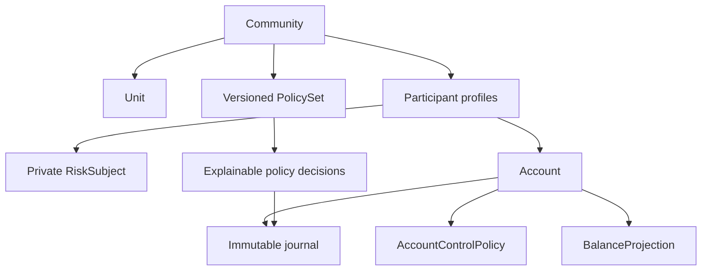
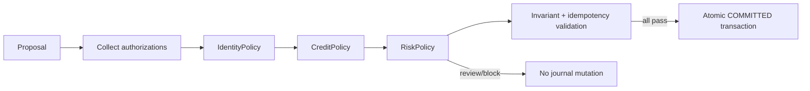

# osTRIS Single Community Mutual Credit Core v0.1

Status: **Normative architecture paired with `CORE_WIRE_AND_DECISION_SEMANTICS_V0_1.md`**

## Scope

Core v0.1 defines one autonomous `Community`, one or more community-local units, participants, accounts, versioned policies, an immutable journal and explainable risk controls. Federation, portable reputation, cross-community clearing, wallets, payments, tokens and AI decision-making are out of scope.



## Canonical concepts

The minimum domain is:

- `Community`, `Unit`, `PolicySet` and immutable policy versions;
- `Participant` as community-visible membership/profile;
- `IdentityAssuranceClaim` and private `RiskSubject` linkage;
- `Account`, `AccountControlPolicy`, `BalanceProjection`, `creditFloor`, `RiskState`;
- `MutualCreditTransaction`, `Entry`, `AuthorizationEvidence`, `PolicyDecisionSnapshot`;
- `Dispute`, `RiskCase`, `Finding`, `Appeal`, `RiskEvent`;
- typed transactions for reversal, settlement, write-off, restitution and penalty;
- governed `CommunityLossAccount` and `CommunityPenaltyAccount`.
- `ProtocolEventProofPayload` as the closed commitment to one immutable committed event, distinct from the transaction-intent `protocolDigest`.

`CreditFloor` and `BalanceProjection` are values/projections, not standalone aggregate identities. `FraudFinding` is a typed `Finding`. `ReversalTransaction` and the other economic resolutions use the same transaction primitive plus an explicit purpose and related IDs; they are not separate accounting engines.

## Transaction semantics



A transaction can enter the journal only if:

1. community, unit, accounts and protocol version are valid;
2. at least two entries have exact sum zero;
3. every affected account is authorized either by its effective AccountControlPolicy or by an explicitly permitted GovernedAuthorization covering that account for that exact transaction;
4. IdentityPolicy capabilities are satisfied;
5. CreditPolicy permits voluntary negative exposure;
6. RiskPolicy returns a committing outcome;
7. transaction identity is idempotent and non-conflicting;
8. all entries, evidence references and the decision snapshot commit atomically.

Canonical IDs, wire objects, integer amounts, authorization signatures, CommunitySequence ordering, transaction-purpose relationships and deterministic policy metrics are defined by the Core Wire specification and normative test vectors. Implementations may use different storage/runtime designs but must reproduce those results.

Once committed, the transaction is `COMMITTED` forever. Proposal, authorization collection and review are workflow state outside the journal. Reversal, dispute, settlement, fraud finding, write-off and penalty never mutate the original transaction.

The transaction `protocolDigest` commits only to its exact canonical intent. A `ProtocolEventProofPayload` additionally binds that digest to the immutable `CommunitySequence` and exact state `COMMITTED`. External anchoring is asynchronous integration state: failure or delay never changes the journal, balances, sequence or validity of the committed transaction.

## Governed authorization

`GovernedAuthorization` is the exceptional, protocol-constrained alternative to account consent for community resolutions. It is never an administrator bypass. A versioned `CommunityResolutionAuthority` identifies who may authorize, with immutable authority ID/version, community, stable controller IDs, M-of-N threshold, activation sequence and optional revocation sequence. Policy answers what is allowed; this authority answers who approves it.

Both AccountControlPolicy and CommunityResolutionAuthority count quorum by distinct `controllerId`, never credential, key, signature or evidence row. A controller may have overlapping active Ed25519 credentials during rotation and still contributes one. Each credential has one immutable controller binding within the Community; rebinding and cross-controller public-key aliasing are invalid.

Every affected account still requires authorization. A governed authorization substitutes its AccountControlPolicy only when the purpose/basis matrix permits it, effective policy permits it, and `coveredAccounts` explicitly contains that account. Mixed account/governed authorization is permitted.

| Purpose | Governed route |
|---|---|
| EXCHANGE | forbidden |
| REVERSAL | adjudicated + `FINAL_DISPUTE_RESOLUTION` |
| SETTLEMENT | adjudicated + `FINAL_DISPUTE_RESOLUTION` |
| WRITE_OFF | `FINAL_DEFAULT_DECISION` |
| RESTITUTION | imposed + `FINAL_FINDING` or `FINAL_DISPUTE_RESOLUTION` |
| PENALTY | `FINAL_FINDING` |
| LOSS_OFFSET | `COMMUNITY_GOVERNANCE_DECISION` |

Consensual REVERSAL/SETTLEMENT, voluntary RESTITUTION and all EXCHANGE use AccountControlPolicy authorization. Governed credentials, authority version, basis finality, threshold, covered accounts and effective policies are re-evaluated at commit sequence.

RESTITUTION has two exclusive proposal paths. Voluntary RESTITUTION has no ResolutionBasis, forbids GovernanceAuthorization and the mandate references `finalFindingId`/`disputeResolutionId`, and requires AccountControlPolicy authorization for every affected account. Imposed RESTITUTION requires GovernanceAuthorization and exactly one basis/reference pair: `FINAL_FINDING` with `references.finalFindingId == resolutionBasis.id`, or `FINAL_DISPUTE_RESOLUTION` with `references.disputeResolutionId == resolutionBasis.id`. The other typed reference is forbidden. Path, basis and references are immutable signed proposal intent; mixed evidence or later path conversion rejects.

For governed economics, `PolicyVersion.config_json` is a closed typed object, never a DSL. SanctionPolicy uses exactly `{"schema":"OSTRIS-SANCTION-POLICY-1","penaltyAllowed":boolean,"restitutionFromFinalFindingAllowed":boolean,"restitutionFromFinalDisputeResolutionAllowed":boolean}`. DefaultPolicy uses exactly `{"schema":"OSTRIS-DEFAULT-POLICY-1","writeOffAllowed":boolean}`. Missing policies, ineffective versions, wrong schemas, missing/unknown fields, wrong types or a false relevant flag reject. These flags only narrow the closed purpose/basis matrix; they never enlarge it. LOSS_OFFSET, adjudicated REVERSAL and adjudicated SETTLEMENT require no additional configurable policy in v0.1.

WRITE_OFF v0.1 is full-only: immediately before commit the defaulted account must have a negative balance, its sole positive entry must equal the exact magnitude of that balance, and the sole balancing negative entry must target the CommunityLossAccount, leaving the defaulted account at zero.

## PolicyDecisionSnapshot

Each commit records immutable references to:

```text
controlPolicyRef(s)
identityPolicyRef + satisfied assurance claim references
creditPolicyRef + evaluated floor/exposure facts
riskPolicyRef + outcome + reason codes + observed/configured values
default/sanction policy refs when relevant
evaluation timestamp and evaluator implementation/version
```

Full policy content need not be copied if referenced versions remain immutable and retrievable. A digest protects the policy document. Current configuration alone is never sufficient to explain a historical commit. Policy and authorization validity are evaluated at the transaction's CommunitySequence, not proposal/signature wall-clock time.

## Credit arithmetic

With negative numbers representing used community credit:

```text
creditFloor <= 0
availableNegativeExposure = max(0, balance - creditFloor)
projectedBalance = balance + sum(proposed entries for account)
voluntary exposure allowed only if projectedBalance >= effective creditFloor
enforcedLiability = max(0, creditFloor - balance)
```

Examples: balance `-80`, floor `-100` → available `20`; balance `+20`, floor `-100` → `120`; balance `-80`, newly reduced floor `-50` → `0` available and enforced liability `30`. Changing a floor never creates entries, changes balance or declares default. Only a governed FINAL-finding RESTITUTION/PENALTY that also satisfies the effective typed SanctionPolicy flag may worsen balance below floor; this creates liability, not credit. A policy flag alone grants no authorization.

## Protocol guardrails versus community freedom

Communities may parameterize identity requirements, floors, deterministic risk thresholds, inactivity/default processes, sanctions and rehabilitation. They cannot disable zero sum, journal immutability, required authorization, idempotency, traceability, appeal for adverse findings, privacy boundaries or the separation of preventive risk from established sanctions.

An implementation must reject unknown assurance levels, impossible authorization thresholds, negative time intervals, invalid account/policy references, contradictory activation windows, rules that permit unilateral balance creation, or policy documents outside supported capabilities. Activation is atomic and versioned. Future policy simulation should use the same evaluator in non-committing mode.

## Readiness boundary

Core v0.1 is implementable only together with the wire specification and normative vectors. Federation, portable risk/reputation, reserve design and production legal/operational policy remain outside this conformance claim.
