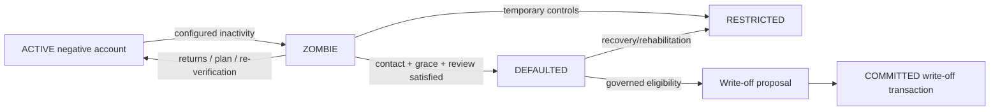
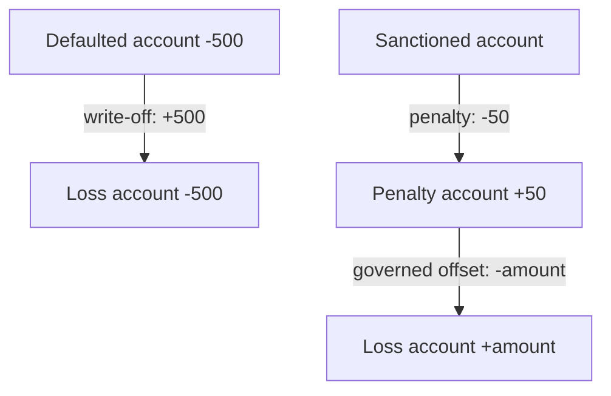

# Default, Sanctions and Economic Recovery

## Default is not fraud

Default may result from illness, business failure, death, mistake or disappearance. Fraud can occur without default. DefaultPolicy handles recovery/non-recovery; a FraudFinding requires evidence and review under case policy.

## DefaultPolicy and ZOMBIE lifecycle

DefaultPolicy versions inactivity, negative-balance condition, contact attempts, grace, required review/approval, write-off eligibility and post-default recovery. No universal day/amount is hardcoded. `DEFAULTED` does not itself alter balance.

## Governed special accounts

- `CommunityLossAccount`: records socialized losses recognized through write-off or governed allocation; never represents a user.
- `CommunityPenaltyAccount`: receives economic penalties imposed by confirmed resolutions; it is separate from losses.
- `CommunityReserveAccount`: deferred for v0.1 unless a pilot explicitly needs and governs it.

Each special account has stable ID, purpose restrictions, AccountControlPolicy, permitted transaction purposes, reporting and governance authority. It cannot create units unilaterally.

## Write-off

Recognizing an unrecoverable `-500` position uses a committed transaction:

| Account               | Entry |
| --------------------- | ----: |
| Defaulted participant |  +500 |
| CommunityLossAccount  |  -500 |

The participant becomes zero and the loss remains visible. V0.1 WRITE_OFF is full-only: the positive entry equals the exact magnitude of the defaulted account's negative pre-commit balance and the balancing negative entry targets CommunityLossAccount. Partial write-off is invalid. The original transactions and default decision remain. Write-off requires an effective closed `OSTRIS-DEFAULT-POLICY-1` with `writeOffAllowed=true`, governed authorization and decision references; it is not automatic inactivity handling.

Specifically, WRITE_OFF requires a final `FINAL_DEFAULT_DECISION` plus effective DefaultPolicy and GovernedAuthorization. PENALTY requires a final `FINAL_FINDING`, effective SanctionPolicy and GovernedAuthorization; it never depends on voluntary signature by the sanctioned account. LOSS_OFFSET requires `COMMUNITY_GOVERNANCE_DECISION`. Imposed RESTITUTION requires `FINAL_FINDING` or `FINAL_DISPUTE_RESOLUTION`; voluntary restitution continues to use account authorization. The governed evidence explicitly lists every account whose normal control it substitutes, including special accounts where applicable.

Voluntary RESTITUTION has no ResolutionBasis and forbids `finalFindingId`, `disputeResolutionId` and GovernanceAuthorization as mandate signals. Imposed finding restitution requires `finalFindingId` equal to its FINAL_FINDING basis ID; imposed dispute restitution requires `disputeResolutionId` equal to its FINAL_DISPUTE_RESOLUTION basis ID. The references are mutually exclusive and signed; changing path, type or ID invalidates evidence.

The SanctionPolicy configuration is exactly `OSTRIS-SANCTION-POLICY-1` with Boolean fields `penaltyAllowed`, `restitutionFromFinalFindingAllowed` and `restitutionFromFinalDisputeResolutionAllowed`. The matching flag must be true. The DefaultPolicy governed-economic configuration is exactly `OSTRIS-DEFAULT-POLICY-1` with Boolean `writeOffAllowed`. Missing, ineffective, revoked, malformed, incomplete or extended configurations reject. Flags narrow but never enlarge the protocol purpose/basis matrix.

## SanctionPolicy

Preventive risk controls are not sanctions. Sanctions follow an established finding and are graduated: warning, re-verification, enhanced approval/monitoring, temporary floor reduction/freeze, restitution, economic penalty, temporary/long-term restriction, denial of new credit and only exceptionally community-defined expulsion.

Non-economic sanctions never create entries. Economic penalties always use an authorized journal transaction, for example sanctioned account `-50`, CommunityPenaltyAccount `+50`. How penalty balances later offset loss, remain reserved, fund projects or support a governed distribution requires another zero-sum transaction and community rule. No “good/noble user” category exists and reporting is not rewarded by default.

## Restitution and fraud proceeds

An original fraudulent transaction remains committed. A confirmed resolution can authorize reversal where parties still hold the positions, restitution from beneficiary to loss/victim accounts, penalty and write-off as distinct transaction purposes.

If A's fraudulent `+500` has already been spent with innocent third parties, their valid transactions are not reversed. Options are an enforceable restitution obligation on A, restriction of A's future capacity, recovery from future positive entries and persistence of community loss until recovered. The journal must never fabricate recovery.

FINAL-finding-authorized RESTITUTION/PENALTY may push an account below its ordinary creditFloor. This creates `enforcedLiability=max(0, creditFloor-balance)` and zero voluntary credit; it does not grant additional credit. The account may receive positive/improving entries. The final Finding, purpose-specific policy and authorization must be referenced.

Finding lifecycle is `UNDER_REVIEW → ISSUED → FINAL` or `ISSUED → APPEALED → FINAL|OVERTURNED`. Only FINAL—appeal deadline elapsed or appeal upheld—authorizes culpability-based economic effects. Earlier restrictions are preventive and non-accounting.

## Rehabilitation and recurrence

Confirmed `RiskEvent`s record type, severity, finding/case, decision, effective time, scope, appeal status and relevance/retention metadata. Repeat-offender rules may consider only confirmed/upheld events, with severity, age, restitution, successful operation and rehabilitation. They produce explainable restrictions/review, not automatic lifetime bans.

Rehabilitation can require restitution completion, sanction service, correct operation over time and manual review; it restores capabilities progressively without deleting history. A new public profile may receive social fresh start while the private community-scoped RiskSubject preserves only lawful, relevant risk continuity.
