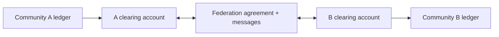

# Federation and Clearing

## Objetivo y frontera

Federación permite interoperar comunidades soberanas sin fusionar sus libros ni asumir `1 A-unit = 1 B-unit`.

Un acuerdo debe identificar comunidades/unidades, capacidades, autorización, ratio o método de valoración, floors bilaterales, ventanas de clearing, finality, dispute/default, privacidad y versiones.

## Modelos candidatos

### Bilateral clearing

Cada comunidad mantiene una cuenta de clearing frente a la otra. Es comprensible y limita contagio, pero crece O(n²) y fragmenta liquidez/exposición.

### Hub o clearing network

Un coordinador calcula posiciones netas multilaterales. Reduce exposición bruta, pero introduce dependencia, reglas de admisión y riesgo/captura del operador. El hub no debería poder crear posiciones desequilibradas.

### Multilateral peer clearing

Comunidades intercambian obligaciones y acuerdan netting sin hub único. Mejora pluralidad, pero exige consenso sobre orden/finality y gestión compleja de defaults.

### Community-to-community mutual credit

Comunidades mantienen posiciones recíprocas bajo floors explícitos. Es mutual credit entre sistemas, pero el riesgo de miembros se agrega a riesgo comunitario y puede propagarse.

## Ratios y settlement

Alternativas para ratios: negociación fija por periodo, unidad-basket acordada, valoración por transacción o mecanismo de gobernanza. Ninguna constituye automáticamente mercado FX ni precio garantizado. Todo redondeo y quién absorbe diferencias debe ser explícito.

Settlement puede consistir en compensación futura de recursos, reducción bilateral/multilateral o medios externos voluntarios. El protocolo base no exige fiat/cripto ni custodia.

## Atomicidad entre libros

Hipótesis a estudiar: prepare/commit coordinado, recibos firmados con compensación o commits independientes con cuentas de suspense. Un Proof común no aporta atomicidad. Debe definirse qué ocurre si A compromete y B no, y cómo se repara sin borrar historia.

## Riesgo y default

Cada enlace requiere exposición máxima, garantías/reservas opcionales, monitoring, suspensión y waterfall de pérdidas. Un default comunitario no debe contaminar automáticamente balances personales sin política previa. Collusion, falsos ratios, replay y falsas capacidades forman parte del threat model.

## No decidido

El modelo inicial, ratio discovery, finality cross-community, privacidad de exposición, autoridad para suspender y portabilidad reputacional quedan abiertos.
