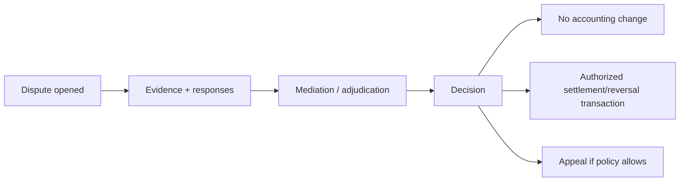

# Governance

## Dos niveles independientes

`Protocol Governance` evoluciona formatos, invariantes y compatibilidad osTRIS. `Community Governance` decide membresía, crédito, disputas, cuentas especiales, privacidad operativa y federaciones locales. Una actualización del protocolo no es una votación comunitaria, ni una comunidad puede redefinir silenciosamente invariantes y seguir reclamando la misma conformidad.

## Objetos gobernados

- creación/modificación/versionado de reglas;
- membership y roles;
- políticas de crédito y default;
- disputas, mediación y appeals;
- acuerdos de federación/clearing;
- privacidad y Proof policy;
- upgrades, deprecation y emergency action.

Cada decisión debería registrar propuesta, versión previa/nueva, electorado o autoridad, autorizaciones, fechas, quórum/regla y justificación; cambios materiales pueden merecer Proof.

Core v0.1 community governance also controls activation of immutable PolicySet versions, AccountControlPolicy for special accounts, Default/Sanction/Rehabilitation policies and any use or redistribution of CommunityPenaltyAccount. Configuration remains subordinate to protocol invariants and invalid policy sets must be rejected.

## Modelos comparados

| Modelo                     | Fortalezas                         | Riesgos                                         |
| -------------------------- | ---------------------------------- | ----------------------------------------------- |
| democracia directa         | legitimidad participativa          | fatiga, baja participación, captura por mayoría |
| delegada                   | escalabilidad y especialización    | concentración, delegaciones opacas              |
| consejo multisig           | control operativo claro            | cartel/captura y baja representatividad         |
| cooperativa/constitucional | límites estables y roles definidos | lentitud y rigidez                              |
| híbrido                    | adapta decisión al riesgo          | complejidad y ambigüedad competencial           |

No se selecciona un modelo único. Sí se exige que la política aplicable sea explícita, verificable y contestable.

## Disputes

Software registra proceso y evidencia; no determina automáticamente quién tiene razón. El ledger prueba hechos registrados, no su verdad sustantiva.

## Default y salida

Default es una clasificación de proceso (p. ej., obligación de restitución incumplida tras reglas/plazos), no sinónimo de saldo negativo. Respuestas posibles: congelar nueva exposición, activar guarantor, reserva/insurance pool, plan de restitución, write-off gobernado y pérdida socializada explícita. Un write-off contable siempre necesita asientos compensados y reglas visibles.

## Upgrades

Mensajes declaran versión y capabilities. Cambios incompatibles requieren nueva versión, ventana de transición, protección contra downgrade y criterios de aceptación. La coexistencia/fork de versiones debe tratarse como posibilidad real, no fallo moral.
