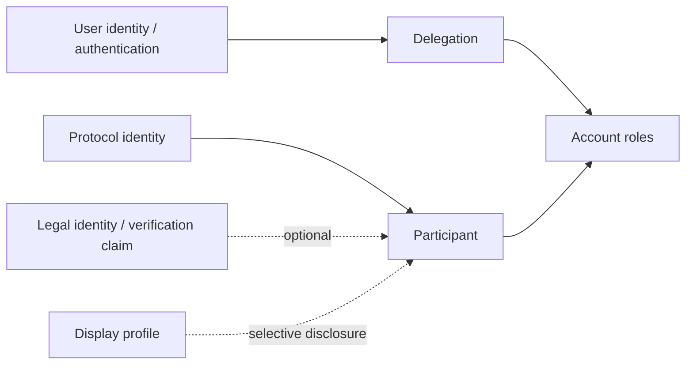

# Identity and Trust

## Capas de identidad

- `ProtocolIdentity`: identificador y material de autorización reconocido por una comunidad.
- `UserIdentity`: sujeto autenticado que opera una aplicación.
- `LegalIdentity`: información/verificación jurídica opcional y protegida.
- `DisplayProfile`: nombre e información que se decide mostrar.

No se presupone equivalencia entre capas ni publicación de identidad legal. Una identidad puede ser pseudónima, verificada, organizativa o delegada.

Phase 2 adds `IdentityAssuranceClaim` as provider-issued limited evidence and a private community-scoped `RiskSubject` for lawful identity/risk continuity across social profiles. Neither is the public Participant profile; the RiskSubject must not be exposed as a global identifier.

## Participantes, organizaciones y cuentas

Un participante representa una persona u organización dentro de una comunidad. Una organización puede tener usuarios, roles, umbrales de aprobación y varias cuentas. Una cuenta pertenece a una comunidad y unidad, y tiene controladores autorizados. `one user = one account` queda expresamente rechazado.

Roles conceptuales mínimos: titular/controlador, operador delegado, aprobador y auditor. La segregación exacta es política comunitaria.

## Trust

Trust es una relación contextual y explícita, no reputación global. Puede expresar “A respalda a B hasta X”, una invitación, patrocinio o garantía. Debe declarar emisor, sujeto, alcance, límite, vigencia y revocabilidad.

Dos familias a comparar:

- límites comunitarios centralizados: simples y gobernables, concentran poder y riesgo administrativo;
- trust graph: granular y plural, pero complejo, sensible a colusión, privacidad y propagación de riesgo.

No se decide routing ni crédito transitivo. La confianza A→B y B→C no implica automáticamente A→C.

## Credit floor como política separada

Un `creditFloor` es el mínimo saldo permitido para una cuenta, no parte del saldo. Puede depender de clase de membresía, verificación, aprobación manual, historial, garantías o combinación. Toda decisión debe ser explicable: política/version, datos considerados, aprobadores, vigencia y vía de impugnación.

Los nuevos participantes deberían tener exposición progresiva hasta acumular evidencia; no se fijan cifras. Aumentar un límite no crea saldo. Reducirlo por debajo del saldo actual no reescribe el libro: bloquea nueva exposición y activa un proceso explícito.

## Sybil resistance

Controles combinables: invitación, patrocinio, límites iniciales bajos, verificación selectiva, identity providers comunitarios, espera/maduración y detección de clusters. KYC global no es requisito del protocolo, pero una comunidad regulada puede exigir verificación privada.
