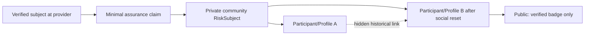

# Identity Assurance and Social Reset

## Assurance claims

Identity Assurance expresses what a provider verified about a subject. Level labels are community/profile vocabulary until exact semantics are standardized.

| Candidate label | Illustrative meaning                      | Explicitly does not prove                     |
| --------------- | ----------------------------------------- | --------------------------------------------- |
| IA0             | persistent pseudonymous control           | legal identity, uniqueness, honesty           |
| IA1             | control of contact channel                | uniqueness, legal name, solvency              |
| IA2             | identity attributes verified              | honesty, future behavior, financial capacity  |
| IA3             | enhanced/context-specific checks          | absence of fraud or universal suitability     |
| IA4             | organization existence/authority verified | continuity under all restructurings, solvency |

An `IdentityAssuranceClaim` records an opaque claim ID, provider ID/type, claim profile/version, subject reference, issued/verified/expiry times, status, revocation reference and minimal disclosed attributes. Exact evidence remains with the provider whenever possible.

`IdentityVerificationProvider` is a provider-neutral capability implemented later by external KYC, government/eID, manual community or organizational verification. Providers have trust configuration, supported profiles, key/credential history and revocation/availability semantics. osTRIS stores references and results, not scans/selfies/address documents unless a separately justified process requires them.

KYC establishes limited identity assurance; it does not establish trust, honesty, solvency, quality or future performance, and it does not prevent verified people from colluding.

## Public profile, participant and private risk continuity

`Participant` is a community-scoped social/economic profile. `RiskSubject` is a restricted, pseudonymous community-internal correlation anchor for confirmed identity continuity, historical profiles/accounts and risk events. It is not public, is not a global person ID and must not use DNI, passport, email, phone, tax ID or their unsalted hash.

Internal correlation uses an opaque UUIDv7 RiskSubject ID. Provider subject references should be stable opaque community/pairwise values; raw identifiers remain outside the economic model. Without a strong provider reference, a sequenced IdentityContinuityDecision records evidence, authority and status `CONFIRMED`, `CONTESTED` or `REJECTED`. Incorrect matches support review and appeal.

## Social reset versus risk reset

A person may retire Profile A, delete/minimize its public/social content and create Profile B. Public reputation, listings and social identity need not follow. Accounts with journal history are closed/dormant, not erased if accounting retention applies.

Only a CONFIRMED continuity applies historical risk automatically. A CONTESTED link can cause REQUIRE_REVIEW or temporary prevention, never culpability-based sanction by itself. Minimal private history may continue for fraud prevention, default recovery or sanction enforcement but cannot become a permanent public dossier. Community policy controls purpose, access, retention, relevance/decay and appeal; legal basis requires jurisdiction-specific review.

Organizations follow the same principle only when verified legal/organizational continuity is established. Shared owners, directors or addresses alone do not automatically prove the same organization.

## Lifecycle

Claims can be active, expired, revoked or superseded. Renewal creates new evidence; revocation does not rewrite transactions historically authorized while a claim was valid, but may restrict future capabilities. A social reset never changes account balance or journal history.

**LEGAL REVIEW REQUIRED before production.**
