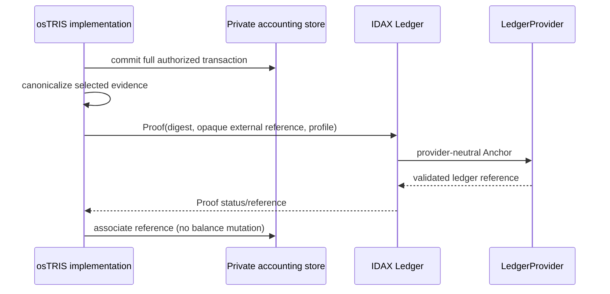

# IDAX Ledger Integration

## Boundary

osTRIS conoce sólo capacidades públicas Proof/Anchor/Verification. No conoce AccountSet, Memo, Sequence, NuDB ni validators. IDAX Ledger no conoce mutual credit, balances, offers, reputation o governance semantics.

## Eventos candidatos a Proof

| Evento                         | Valor probatorio                     | Política inicial candidata                |
| ------------------------------ | ------------------------------------ | ----------------------------------------- |
| transaction committed          | integridad/existencia del commitment | sí, individual o batch según riesgo       |
| reversal/settlement committed  | cadena histórica                     | sí, enlazado sin exponer contenido        |
| agreement accepted             | prueba de términos previos           | opt-in o por clase de acuerdo             |
| community rule version         | demostrar regla aplicable            | sí para cambios materiales                |
| governance decision            | auditabilidad                        | sí cuando cambia autoridad/regla material |
| propuestas, lecturas, UI edits | poco valor/frecuencia alta           | no por defecto                            |

Anchor no convierte una propuesta en commit, no demuestra legalidad, verdad del servicio ni autorización salvo que el commitment verificable incluya esa evidencia de forma adecuada.

## ProtocolEventProof v1

La implementación conserva la operación completa. `protocolDigest` sigue siendo `SHA-256(JCS_UTF8(canonical transaction intent))`. `proofDigest` es un compromiso diferente: enlaza ese digest con el evento inmutable `COMMITTED` y su `CommunitySequence` mediante `ProtocolEventProofPayload v1` y el separador `OSTRIS:PROTOCOL:EVENT:PROOF:V1`, definidos byte por byte en `CORE_WIRE_AND_DECISION_SEMANTICS_V0_1.md`.

Antes de cada entrega o retry, el adapter DEBE cargar el journal committed, reconstruir el intent canónico, recalcular `protocolDigest`, exigir igualdad con el persistido, reconstruir el Proof y comparar cualquier digest/referencia guardados en outbox. Un mismatch falla cerrado y no se envía. El outbox es estado de entrega, nunca otra verdad protocolaria.

IDAX Ledger recibe el perfil `EXTERNAL:OSTRIS-PROTOCOL-EVENT-PROOF-V1`, `proofDigest`, la referencia opaca derivada y sólo metadata mínima. Nunca recibe entries, amounts, balances, Participant/Account/RiskSubject/KYC, cuerpos de Finding/Resolution, policy configs o el journal completo. osTRIS no construye AccountSet ni Memo y no gestiona claves XRPL.

## Proof por transacción vs batching

| Opción              | Ventajas                                        | Costes/riesgos                                                                    |
| ------------------- | ----------------------------------------------- | --------------------------------------------------------------------------------- |
| uno por transacción | comprobación simple y baja latencia             | coste, volumen y correlación temporal                                             |
| Merkle batch        | escala, menor coste y menor correlación directa | espera, gestión de inclusion proofs, ordering y disponibilidad del batch manifest |

En batching: hojas domain-separated incluyen transaction ID opaco y commitment; orden canónico y duplicados deben estar definidos; root se ancla; cada participante recibe inclusion proof. No se implementa ni se elige tamaño/ventana.

## Fallos y semántica

El commit contable no debe depender de disponibilidad del provider. Un Proof puede quedar pendiente/reintentable sin revertir el intercambio. Una política puede exigir anchor validado antes de un acto externo de alto riesgo, pero debe nombrar ese estado por separado de `COMMITTED`.

La entrega es **at-least-once** y Ledger debe tratarla idempotentemente. No se requiere XA, exactly-once distribuido, Kafka ni participación de XRPL en la transacción PostgreSQL económica. Proof IDs, public IDs, transaction hashes, ledger index/hash y estados provider son metadata de integración y nunca influyen en `proofDigest` ni modifican historia económica.

## Verificación

Debe distinguir: integridad del contenido presentado, inclusión/validación del anchor, correspondencia de versión/perfil y autorización osTRIS. Un resultado Ledger `VALIDATED_MATCH` sólo resuelve la capa de anchor.

El estado osTRIS `ANCHORED` significa exclusivamente que IDAX Ledger estableció `VALIDATED_MATCH`. `HTTP 201`, Proof persistido, `SIGNED`, `SUBMITTED`, `VALIDATED` aislado o `MATCH` sin inclusión validada son insuficientes. Mismatch o fallo terminal afectan sólo integración/revisión; nunca alteran `journal_transaction`, `journal_entry`, balances, `CommunitySequence` ni `COMMITTED`.

Tras restart, una implementación conforme debe reproducir el mismo `proofDigest` exclusivamente desde el journal committed e inmutable. Wall clock, memoria de proceso y contenido mutable del outbox no son entradas normativas.
