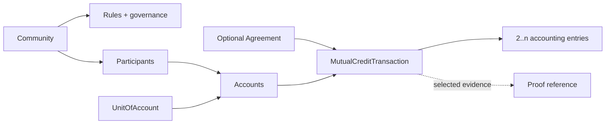
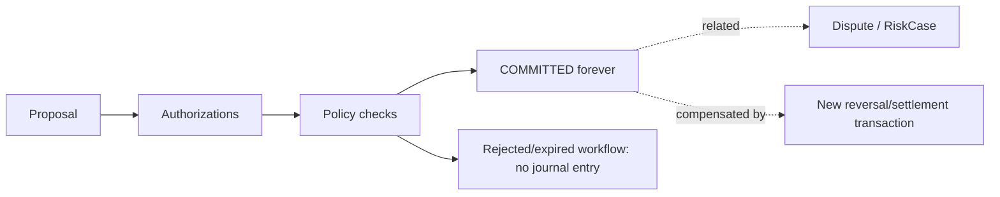

# Mutual Credit Architecture

## Definición

Crédito mutuo es un sistema contable donde los participantes aceptan crédito de la comunidad. El crédito se crea como entradas simultáneas que suman cero y se extingue por intercambios compensatorios. No requiere deuda bilateral: quien queda negativo puede aportar valor después a cualquier participante aceptado.

## Contexto de componentes



### Conceptos y separación

- `Community`: ámbito soberano de membresía, reglas, unidad, crédito y gobernanza.
- `Participant`: persona u organización reconocida por una comunidad.
- `Identity`: identificador/procedencia de autenticación; no equivale a participante.
- `Account`: libro contable dentro de una comunidad y unidad. Un participante puede controlar varias cuentas mediante roles.
- `Agreement`: compromiso previo opcional sobre un intercambio. No es un listing ni requisito de toda transacción.
- `MutualCreditTransaction`: hecho contable autorizado, versionado y compuesto por dos o más entradas.

## Transacción conceptual

Debe expresar, sin prescribir almacenamiento:

```text
protocolVersion, transactionId, communityId, unitId
createdAt, effectiveAt?, participants/accounts
entries[{accountId, signedAmount}]
authorizationEvidence[]
descriptionReference?, agreementId?, policyVersion
status, originalTransactionId?, proofReference?
```

La descripción puede permanecer fuera de mensajes compartidos o sustituirse por una referencia protegida. `transactionId` es globalmente estable dentro de su espacio de nombres y define idempotencia semántica.

## Transaction workflow and immutable accounting state



Proposal and authorization collection are workflow records, not accounting states. A transaction incorporated into the journal is `COMMITTED` forever. `REVERSED` is not a transaction state: reversal is another committed transaction. `DISPUTED` belongs to a related process and never replaces accounting state.

## Autorización

Each account's versioned `AccountControlPolicy` determines controllers, threshold, delegated scope, validity and revocation. Firma digital, autenticación fuerte y aceptación explícita son mecanismos posibles; v0.1 no elige criptografía. El servidor que materializa una propuesta no se convierte por ello en parte autorizante.

## Crédito y límites

`balance` es suma de entradas comprometidas. `creditFloor` es capacidad separada, producida por una CreditPolicy versionada. Cambiar el floor nunca cambia balance ni declara default. RiskPolicy evalúa además la operación concreta y su exposición; capacidad disponible no implica aceptación automática.

## Resource exchange y The Market

Bienes, servicios, tiempo, conocimientos, acceso, trabajo o recursos acordados pueden explicar una transacción. The Market puede convertir `I OFFER`/`I NEED` en un `Agreement`, pero listings, búsqueda, mensajería y matching permanecen fuera del núcleo.

## Protocolo frente a implementación

El protocolo debe publicar semántica y formatos canónicos independientes de lenguaje. Una implementación IDAX, Python u otra puede almacenar y servir datos de forma diferente si conserva invariantes, autorización, idempotencia y compatibilidad declarada.
