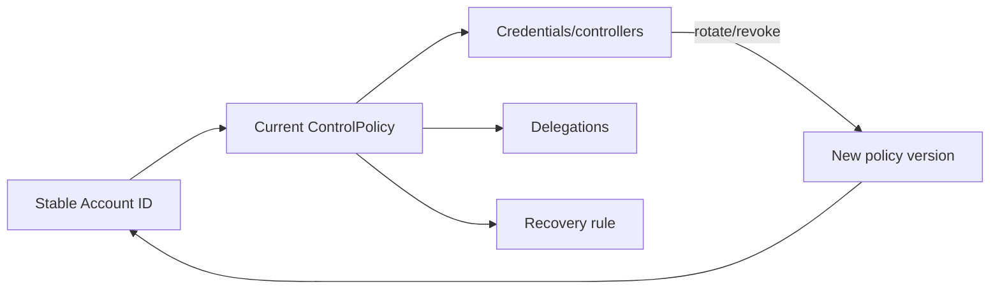

# Policy Architecture v0.1

## PolicySet and versioning

A community activates immutable policy versions through a `PolicySet`. At an activation CommunitySequence, exactly one applicable version per required policy type is selected for a capability/context. Superseding a version never edits it. Transactions use versions effective immediately before their commit sequence and retain the decision references used at evaluation.

| Policy               | Normative question                                                          | Must not decide                               |
| -------------------- | --------------------------------------------------------------------------- | --------------------------------------------- |
| AccountControlPolicy | Who may authorize this account operation?                                   | identity truth, credit amount, fraud guilt    |
| IdentityPolicy       | What assurance claims are required for a capability?                        | honesty, solvency, account authorization      |
| CreditPolicy         | How much voluntary negative exposure is available?                          | whether this particular pattern is acceptable |
| RiskPolicy           | Is this proposed operation acceptable despite capacity?                     | guilt or punishment                           |
| DefaultPolicy        | When/how does inactivity or non-recovery become default/write-off eligible? | fraud finding                                 |
| SanctionPolicy       | What consequence follows an established finding?                            | preventive transaction screening              |
| RehabilitationPolicy | How can restrictions/relevance decline after remedy/time?                   | deletion of historical facts                  |

## AccountControlPolicy

Every account **MUST** reference an immutable, versioned control policy containing:

```text
policyId/version, accountId, controllers
authorization rule (1-of-1, 1-of-N, M-of-N, role-based)
delegations with scope/amount/time limits
validFrom/validUntil, revocations
recovery rule and audit requirements
```

`Controller` is a stable protocol authorization principal identified by UUIDv7 `controllerId`. It is neither a Participant, RiskSubject nor assertion about a natural person. Policy/authority versions select the eligible controllers; controllers are the units of quorum; credentials are only cryptographic signing mechanisms.

A `ControllerCredentialBinding` contains `controllerId`, `credentialId`, `activationSequence` and optional `revocationSequence`. The binding is evaluated immediately before commit. A credential must resolve to exactly one active eligible controller. Unbound, revoked or ambiguous resolution fails closed. A `credentialId` is permanently bound to its original `controllerId` and may be revoked but never rebound.

M-of-N counts distinct eligible `controllerId` values. Multiple evidence rows, signatures, public keys or simultaneously active rotation credentials for one controller contribute exactly one. Safe rotation may overlap active credentials without changing quorum. Within a Community, the same Ed25519 public key cannot back eligible credentials assigned to different controllers; ambiguous key resolution fails closed.



Keys and credentials rotate without changing account ID, balance or journal. Delegated authority is explicit and cannot exceed its scope. An M-of-N threshold must satisfy `1 <= M <= distinct eligible N`.

Recovery models may use recovery controllers, community-controlled threshold, external identity verification or organizational administrators. No single administrator receives silent universal takeover. Recovery produces a new ControlPolicy version plus immutable audit event and authorization evidence; it never rewrites historical authorizations.

## IdentityPolicy

Maps capabilities—joining, receiving an initial floor, operating an organization, crossing a threshold—to accepted assurance claim types/providers/status/age. It evaluates evidence, not personal merit. KYC is one possible verification mechanism.

## CommunityResolutionAuthority

This immutable, versioned control structure answers who may execute a governed resolution; SanctionPolicy, DefaultPolicy and GovernancePolicy answer what is allowed. It has no account or balance. It contains stable controller IDs and an M-of-N threshold; controller credentials are resolved through the same immutable binding semantics used by AccountControlPolicy. Its threshold, controller, binding and credential validity are evaluated immediately before commit. Risk reviewer, Finding authority and resolution controllers may be distinct sets; no superadmin receives implicit authority.

## CreditPolicy

Produces an effective `creditFloor` and an explainable decision from parameters such as assurance class, account age, base floor, manual approval, guarantees or progressive tiers. It is configurable and versioned; v0.1 does not mandate a universal formula. Floor changes affect future capacity only.

## RiskPolicy

Evaluates the concrete proposal using deterministic exposure and graph signals. CreditPolicy answering “capacity exists” does not imply RiskPolicy answering “this operation is acceptable.” Risk signals cannot establish guilt or directly impose sanctions.

Minimum candidate outcomes:

- `ALLOW`: commit if all other checks pass;
- `ALLOW_WITH_FLAG`: commit and create an auditable signal for follow-up;
- `REQUIRE_REVIEW`: do not commit until an authorized review resolves it;
- `BLOCK_NEW_EXPOSURE`: do not commit because the proposal would add prohibited exposure.

Additional authorization is modeled as an AccountControlPolicy/transaction requirement attached by RiskPolicy, not a fifth outcome; after evidence is added, evaluation runs again. Every nontrivial outcome includes stable reason code, policy/rule reference, observed value, configured boundary and relevant evidence references.

When rules disagree, precedence is `BLOCK_NEW_EXPOSURE > REQUIRE_REVIEW > ALLOW_WITH_FLAG > ALLOW`. The five portable metric formulas and sequence-window semantics are fixed by the wire specification; communities configure window size, thresholds, operators and resulting outcome.

## Default, sanction and rehabilitation

DefaultPolicy defines inactivity interval, negative-balance threshold/condition, contact attempts, grace, review, write-off eligibility and recovery. SanctionPolicy consumes established findings and can issue graduated non-economic restrictions or authorize economic resolution proposals. RehabilitationPolicy defines restitution completion, served restrictions, time relevance, review and progressive capability restoration without erasing facts.

Governed economic permissions use two closed v0.1 configurations:

```json
{"schema":"OSTRIS-SANCTION-POLICY-1","penaltyAllowed":true,"restitutionFromFinalFindingAllowed":true,"restitutionFromFinalDisputeResolutionAllowed":true}
{"schema":"OSTRIS-DEFAULT-POLICY-1","writeOffAllowed":true}
```

Every field is required and exactly typed; additional fields reject. At the prospective commit CommunitySequence, PENALTY requires the SanctionPolicy penalty flag, imposed RESTITUTION requires the flag matching its basis, and WRITE_OFF requires the DefaultPolicy write-off flag. Policy evaluation produces only a derived PERMITTED/REJECTED result and policy-version reference; it is not another authorization source. LOSS_OFFSET and adjudicated REVERSAL/SETTLEMENT are fixed by the protocol matrix and have no additional configurable policy in v0.1.

## Parameterization without a DSL

V0.1 needs typed configuration fields and named deterministic rules, not arbitrary scripts. Candidate portable parameters include minimum assurance, account age, base floor, manual-review amount, single-counterparty exposure, floor-utilization percentage, zombie interval, default grace and repeat-finding bands. Unsupported rule types and unknown normative fields must fail closed.
