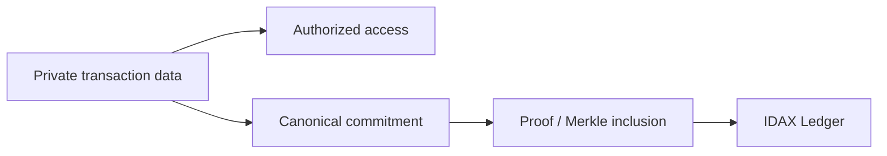

# Privacy Architecture

## Principio

Transparencia significa reglas e integridad verificables, no publicación indiscriminada. Minimización, separación de funciones, control de acceso y divulgación selectiva preceden al anclaje.

## Niveles de visibilidad

| Nivel               | Ejemplos candidatos                                                       |
| ------------------- | ------------------------------------------------------------------------- |
| private             | PII, identidad legal, texto completo, evidencia de disputa                |
| participant-visible | términos y entradas que afectan a las partes                              |
| community-visible   | reglas, decisiones, agregados y auditoría autorizada                      |
| publicly-verifiable | digest/receipt opaco, versión, prueba de inclusión mínima                 |
| public              | especificación, políticas publicadas, estadísticas realmente anonimizadas |

Clasificación se realiza por campo/claim y propósito, no por documento entero. Acceso comunitario no equivale a Internet público.

## Commitments y hashes

Un hash no anonimiza. Email, DNI o teléfono tienen espacios de búsqueda atacables. Nunca se anclan hashes ingenuos de PII ni payloads predecibles. Diseños futuros deben usar identificadores opacos, commitments con nonce/salt de alta entropía gestionado fuera del ledger o esquemas criptográficos revisados. Perder el nonce puede impedir verificación; conservarlo puede permitir correlación.

## Borrado e inmutabilidad

PII permanece off-ledger y separada de IDs públicos. Borrado o crypto-shredding puede inutilizar datos/cifrado bajo política de retención, mientras el ledger conserva un commitment opaco que no permite reconstrucción razonable. La transacción contable inmutable puede requerir conservar atributos mínimos por obligaciones legítimas; esto necesita evaluación jurídica y DPIA.

## Riesgos de metadatos

Incluso digests revelan timing, frecuencia, batch size, correlación y relaciones si los IDs son reutilizables. Mitigaciones candidatas: batching, ventanas temporales, IDs no correlacionables, acceso autenticado a proofs, padding y reducción de metadata. Cada una tiene costes de latencia y operabilidad.

## Derechos y auditoría

Participantes necesitan acceso, rectificación de perfil (sin reescribir journal), contestación, trazabilidad de accesos y exportación contextual. La política debe distinguir borrado de PII, corrección contable y retención probatoria.

## Identity assurance, social reset and risk continuity

Identity providers should retain source KYC documents where possible. osTRIS prefers opaque verification reference, assurance profile/level, provider, verification/expiry time and status. Legal identity is not public profile: other participants may see a scoped “verified” claim without legal name, document number, birth date, address or evidence.

A social reset may remove/minimize public profile, listings and social reputation and may introduce a new Participant. It does not erase committed journal entries or automatically reset a verified community-scoped RiskSubject. The private link/history must be restricted, purpose-limited, minimal, access-audited, retention-controlled and contestable. It must not become a public permanent dossier or portable/global blacklist.

Data categories require separate treatment:

- erasable/minimizable: public profile, optional social content and unnecessary provider artifacts;
- pseudonymizable/separable: provider references, internal RiskSubject link and historical account links;
- potentially retainable: minimum accounting records, confirmed findings/defaults/sanctions and appeal outcomes for defined purposes/periods;
- never public identifiers: DNI, passport, email, phone, tax ID or plain SHA-256 thereof.

The lawful basis, retention period, erasure exceptions and automated/manual decision obligations depend on jurisdiction and role. **LEGAL REVIEW REQUIRED before production.**
