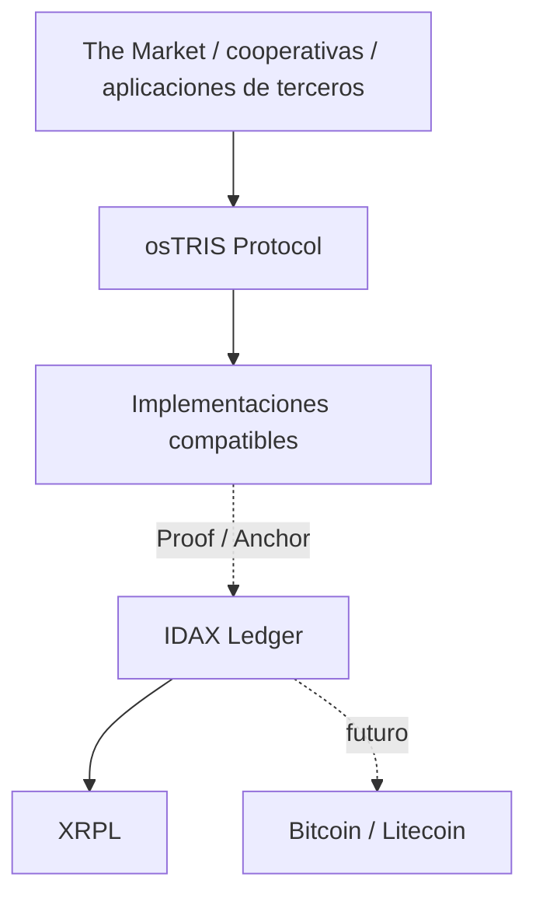

# osTRIS Protocol / Mutual Credit Architecture v2

Estado: **Fase 3 — Core Wire & Decision Semantics v0.1; implementation-ready specification**

Alcance: protocolo conceptual; ninguna implementación forma parte de esta fase.

osTRIS (Open Source Transparent Resource Interchange System) es un protocolo abierto para que comunidades independientes registren intercambios mediante crédito mutuo. Las unidades contables nacen como entradas compensadas de una transacción, no como tokens preemitidos. El protocolo separa contabilidad, identidad, reputación, gobernanza, privacidad y prueba criptográfica.

## Límites

- The Market puede publicar ofertas, necesidades, búsqueda y mensajería; esos conceptos no pertenecen al núcleo contable.
- osTRIS define semántica, invariantes, mensajes y transiciones, no tablas ni DTO Java.
- IDAX Ledger prueba existencia e integridad. No conoce balances, crédito, reputación ni gobernanza.
- El protocolo no emite tokens, no custodia fiat/cripto, no garantiza convertibilidad y no genera interés por el paso del tiempo.

## Mapa documental

| Documento                                                                            | Pregunta principal                              |
| ------------------------------------------------------------------------------------ | ----------------------------------------------- |
| [OSTRIS_PRINCIPLES.md](OSTRIS_PRINCIPLES.md)                                         | ¿Qué es osTRIS y cómo se reinterpreta 2011?     |
| [MUTUAL_CREDIT_ARCHITECTURE.md](MUTUAL_CREDIT_ARCHITECTURE.md)                       | ¿Cuál es el dominio y el ciclo de vida?         |
| [CORE_PROTOCOL_V0_1.md](CORE_PROTOCOL_V0_1.md)                                       | ¿Cuál es el núcleo Single Community v0.1?       |
| [CORE_WIRE_AND_DECISION_SEMANTICS_V0_1.md](CORE_WIRE_AND_DECISION_SEMANTICS_V0_1.md) | ¿Qué bytes, firmas y decisiones son normativos? |
| [POLICY_ARCHITECTURE.md](POLICY_ARCHITECTURE.md)                                     | ¿Cómo se separan y versionan las políticas?     |
| [ACCOUNTING_MODEL.md](ACCOUNTING_MODEL.md)                                           | ¿Cómo funciona la doble entrada?                |
| [INVARIANTS.md](INVARIANTS.md)                                                       | ¿Qué debe cumplir toda implementación?          |
| [IDENTITY_AND_TRUST.md](IDENTITY_AND_TRUST.md)                                       | ¿Quién actúa, autoriza y recibe crédito?        |
| [IDENTITY_ASSURANCE.md](IDENTITY_ASSURANCE.md)                                       | ¿Cómo funcionan assurance y social reset?       |
| [REPUTATION.md](REPUTATION.md)                                                       | ¿Cómo se separan reputación y saldo?            |
| [RISK_ARCHITECTURE.md](RISK_ARCHITECTURE.md)                                         | ¿Cómo se evalúan exposición y riesgo?           |
| [DEFAULT_SANCTIONS_AND_RECOVERY.md](DEFAULT_SANCTIONS_AND_RECOVERY.md)               | ¿Cómo se resuelven default y sanciones?         |
| [GOVERNANCE.md](GOVERNANCE.md)                                                       | ¿Cómo evolucionan protocolo y comunidades?      |
| [FEDERATION_AND_CLEARING.md](FEDERATION_AND_CLEARING.md)                             | ¿Cómo se conectan comunidades?                  |
| [PRIVACY.md](PRIVACY.md)                                                             | ¿Qué se revela y a quién?                       |
| [THREAT_MODEL.md](THREAT_MODEL.md)                                                   | ¿Qué ataques condicionan el diseño?             |
| [LEDGER_INTEGRATION.md](LEDGER_INTEGRATION.md)                                       | ¿Qué merece Proof/Anchor?                       |
| [adr/ADR-015-protocol-event-proof-v1.md](adr/ADR-015-protocol-event-proof-v1.md)     | ¿Qué bytes prueban un evento committed?         |
| [LEGAL_CONSIDERATIONS.md](LEGAL_CONSIDERATIONS.md)                                   | ¿Qué revisión jurídica queda pendiente?         |
| [SCENARIOS.md](SCENARIOS.md)                                                         | ¿Resiste el modelo casos completos?             |
| [OPEN_QUESTIONS.md](OPEN_QUESTIONS.md)                                               | ¿Qué no se ha decidido todavía?                 |
| [IMPLEMENTATION_READINESS.md](IMPLEMENTATION_READINESS.md)                           | ¿Puede comenzar implementación compatible?      |
| [test-vectors/](test-vectors/)                                                       | ¿Qué resultados debe reproducir un core?        |
| [reference/](reference/)                                                             | ¿Cómo se verificaron en Python y Node?          |
| [GLOSSARY.md](GLOSSARY.md)                                                           | ¿Qué significa cada término?                    |
| [adr/](adr/)                                                                         | ¿Qué decisiones normativas se han tomado?       |

## Conformance y lenguaje normativo

Los términos **DEBE**, **NO DEBE**, **DEBERÍA**, **NO DEBERÍA** y **PUEDE** expresan requisitos, recomendaciones y opciones de diseño. Esta versión es arquitectura candidata: las decisiones se vuelven vinculantes sólo tras revisión humana y publicación de una versión del protocolo.

## Phase 3 interoperability gate

The wire, vectors and two-runtime verification pass. This repository remains an architecture/specification project: it contains no product backend, frontend, database, API, Docker, IDAX module or XRPL transaction implementation.

**OSTRIS CORE v0.1: READY FOR IMPLEMENTATION**

**NO IMPLEMENTATION STARTED**
