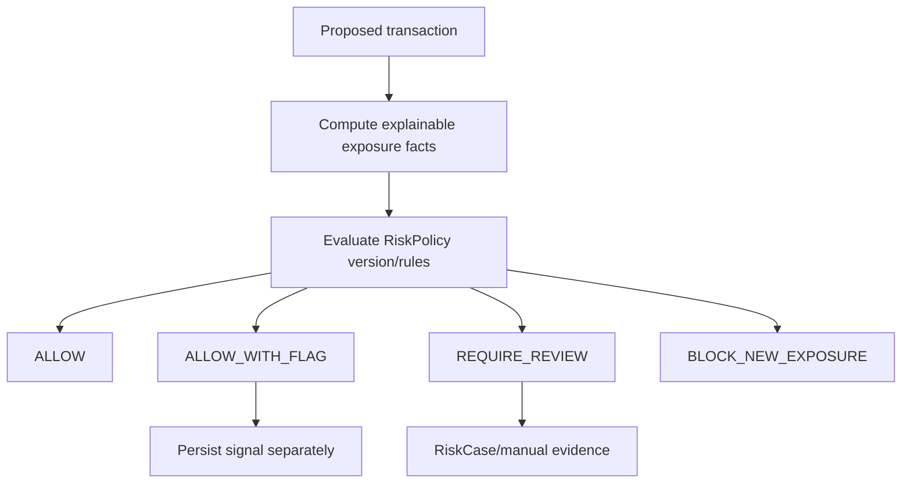
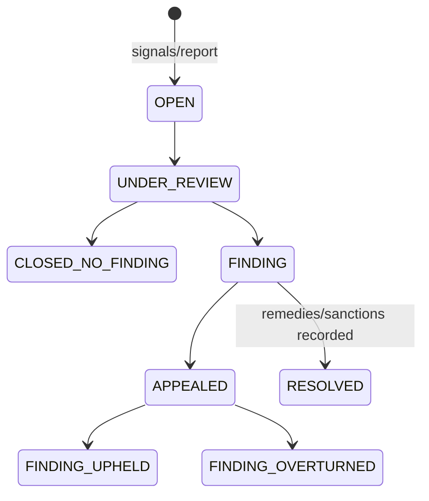

# Risk Architecture v0.1

## Separation

Risk estimates operational/economic exposure for a proposed action. Reputation describes contextual history. A signal is not a finding; a preventive block is not a sanction; default is not fraud.

## RiskSubject, exposure and origin of balances

`Exposure` is a reconstructible risk view over journal entries and relationships, not a balance. A positive balance can be risky when concentrated in collusive or default-linked counterparties.

The normative v0.1 metrics are exactly:

```text
FLOOR_UTILIZATION
COUNTERPARTY_CONCENTRATION
COUNTERPARTY_COUNT
RECENT_VOLUME
RECIPROCAL_EXPOSURE
```

Their exact integer/basis-point formulas, bilateral eligibility, zero denominators and CommunitySequence window are frozen in the wire specification. Circularity/default proximity may be community-local signals but are not portable Core metrics. Default proximity is never automatic guilt by association.

## Deterministic decision flow



Candidate signals: new accounts, unusual amount, rapid floor use, concentration, reciprocal/circular activity, links to confirmed defaults, many-account bursts and sudden extraction. They raise risk but do not prove fraud. V0.1 uses deterministic rules, thresholds, graph metrics and manual review; no opaque AI authority.

Aggregate outcome precedence is `BLOCK_NEW_EXPOSURE > REQUIRE_REVIEW > ALLOW_WITH_FLAG > ALLOW`.

## Risk states

Risk/account operational state is separate from transaction status:

- `ACTIVE`: eligible for normal policy evaluation;
- `DORMANT`: no recent activity, without the specific negative-balance recovery concern;
- `ZOMBIE`: negative balance plus policy-defined inactivity, not yet defaulted;
- `UNDER_REVIEW`: a case/recovery review temporarily controls new exposure;
- `RESTRICTED`: a confirmed decision limits capabilities;
- `DEFAULTED`: DefaultPolicy process declared non-recovery/default.

`ZOMBIE` is not guilt and never triggers write-off solely by elapsed time. Contact attempts, grace, re-verification, manual review or repayment plan may lead `ZOMBIE → ACTIVE`, `RESTRICTED` or `DEFAULTED`. Durations/thresholds are community parameters.

## Cases and findings



A `RiskCase` holds signals, evidence references, affected transactions, participants/RiskSubjects, reviewers, decisions and appeal. A `Finding` may be fraud, identity abuse or another violation. Only confirmed/upheld findings become historical `RiskEvent`s eligible for recurrence rules; raw flags do not become antecedents.

## Collusive credit extraction

A and B fabricate `A +500 / B -500`; B disappears while A retains spendable positive balance. Individual floor enforcement only caps B and does not protect the community from converting B's capacity into A's asset. Controls span:

- prevent: initial/progressive floors, relationship exposure limit, extra authorization;
- detect: concentration, reciprocal/circular/burst patterns, shared counterparties;
- limit damage: review/block, staged capacity, special controls on high-risk flows;
- recover: evidence-led restitution, restrictions, penalties and loss accounting.

Many-account collusion, straw participants, synthetic identity/provider abuse, serial re-registration and laundering through legitimate third parties are variants. KYC reduces some re-registration risk, not collusion.

## Risk propagation

A counterparty default creates a scoped signal. Automatic sanctions on all counterparties are prohibited. Repeated concentration, coordinated timing and confirmed relationships may justify review. Policy must expose which facts, not a generic inherited score, affected the result.

## Audit example

```text
Outcome: REQUIRE_REVIEW
Reason: RISK_COUNTERPARTY_CONCENTRATION
Rule: RiskPolicy v4 / CP-07
Observed: 82% over 90-day positive inflows
Configured maximum: 70%
Evidence references: [...]
```
